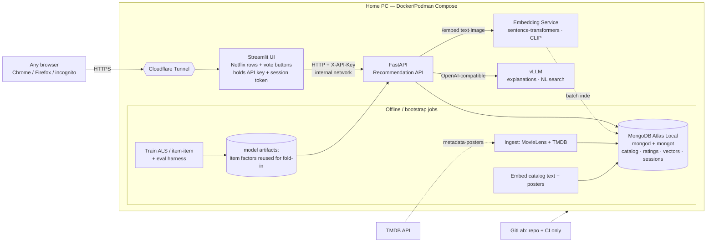

# Movie Recommender — Implementation Plan

## Context

This is a greenfield portfolio project: a Netflix-style movie recommendation product built to mirror — and visibly demonstrate — the work Christian actually does as an Applied AI Engineer on Dillard's Generative AI team. His resume centers on an **in-house recommendation system using vector search (FAISS/Milvus) that replaced an ~$800K/yr vendor**, FastAPI AI services, vLLM inference, embeddings/RAG, CLIP multimodal work, and Podman/OpenShift deployment. This project re-tells that story on a public, reproducible stack: MovieLens + TMDB data, a classical collaborative-filtering core, a semantic/visual vector layer in MongoDB, a local vLLM LLM for explanations and natural-language search, all wired together with `uv`, FastAPI, Streamlit, and Docker/Podman Compose.

The goal is a plan that a single engineer can execute as **10 independent, mergeable sessions**, each ending with a working repo, real tests, and something demonstrable. (The original 9-session shape grew by one session — real-time session personalization — plus a tunnel/exposure step folded into the finale, after the scope was expanded to a live, publicly demoable, per-connection voting experience.)

### Decisions locked this session (from clarifying Q&A)
- **LLM/embedding serving:** **vLLM** (OpenAI-compatible) for generation on a real local GPU; a dedicated GPU embedding microservice (sentence-transformers + open_clip) for text + poster vectors. Matches the resume's vLLM/CUDA stack.
- **Python:** pin **3.12** (safest wheels for `implicit`, scipy, torch). The scaffold's current `3.14` pin is changed in Session 1.
- **Multimodal:** **include CLIP poster embeddings** (visual similarity) — genuine resume flex, one dedicated session.
- **Ranking:** **two-stage retrieve → rerank** — ALS/item-item retrieves candidates, a reranker blends signals. Mirrors "Recommendation Systems (Retrieval + Ranking)" on the resume.
- **Real-time, session-based personalization (added):** every browser connection is an **anonymous session**. A brand-new connection **cold-starts from popularity**; as the user **up/down-votes** movies, recs re-personalize **in real time** via ALS **fold-in** (a session user-vector solved against fixed item factors, no retraining) plus content/visual centroid steering and downvote suppression.
- **Hosting (added):** **both Streamlit and FastAPI run on the home PC**, exposed through a single **Cloudflare Tunnel** (free, HTTPS, no port-forward, hides home IP). GitLab holds the **repo + CI** only. Because Streamlit is server-side, the API key lives in the Streamlit server env — **never in the browser** — so FastAPI can stay on the internal Docker network with only Streamlit publicly tunneled (an optional second tunnel hostname can expose the API directly, guarded by API-key + CORS).

### Current repo state (not empty)
`projects/movie_recs/` already contains a minimal `uv` scaffold: `.git`, `.gitignore`, `.python-version` (3.14), `.venv`, `README.md`, `main.py`, `pyproject.toml`, `uv.lock`. Session 1 adapts this rather than creating from scratch.

---

## Resume → Stack Fidelity Map

Extracted directly from `Christian_Johnson_Resume.pdf`. Each technology is marked **Used**, **N/A**, or **Replaced** (with one-line justification). Rule followed: do not shoehorn a tool in just to check a box.

| Resume technology | Status | How it's exercised / justification |
|---|---|---|
| Python | **Used** | Primary language throughout. |
| FastAPI | **Used** | Recommendation API (Session 6) + embedding microservice. |
| PyTorch | **Used** | Backs the embedding service (sentence-transformers, open_clip). |
| vLLM | **Used** | Serves the local instruct LLM for explanations + NL search (Session 8). |
| Podman | **Used** | Compose stack is Docker/Podman-compatible; docs show `podman compose`. |
| CLIP | **Used** | Poster image embeddings → visual similarity (Session 5). |
| CUDA / GPU | **Used** | vLLM + embedding service run on a local CUDA GPU. |
| MongoDB | **Used** | Primary datastore **and** vector search (Atlas Local). |
| Pandas | **Used** | MovieLens ingestion + evaluation tables. |
| RAG / Embeddings / Vector Search | **Used** | Semantic retrieval + grounded LLM explanations. |
| Recommendation (Retrieval + Ranking) | **Used** | Two-stage retrieve→rerank is the core of the product. |
| Mistral / LLaMA | **Used** | A small Llama-3.2 / Qwen2.5 instruct model is the default vLLM target; Mistral documented as a drop-in. |
| FAISS | **Replaced** | Consolidated into MongoDB `$vectorSearch` per locked requirement (single store, no dual-write). FAISS kept as a documented alternative. |
| Milvus | **Replaced** | Same as FAISS — MongoDB Atlas Local covers the vector-store role for this scale. |
| IBM DB2 (Vector DB) | **N/A** | Proprietary enterprise DB; MongoDB fills the role in an open, reproducible stack. |
| OpenAI | **Replaced** | Local-only serving (non-goal: no cloud). vLLM replaces the hosted API; provider interface leaves an OpenAI drop-in. |
| OpenShift (OCP) | **Replaced** | Docker/Podman Compose replaces the orchestrator (non-goal: no cloud/K8s). |
| SQL | **N/A** | Document store chosen to match the vector-search workload; MovieLens CSVs load straight to Mongo. |
| NVIDIA A100/H100 (datacenter) | **N/A** | Local consumer/workstation GPU instead; the CUDA/vLLM pattern is identical. |
| Model fine-tuning (MVP-level) | **N/A** | Uses pretrained models only — consistent with the resume's "system design & deployment, not training" positioning. |
| Air-gapped / distributed deployment | **N/A** | Single-node local; the on-prem, no-external-dependency ethos is preserved. |

**Resume gaps this project deliberately fills** (not on the resume, added to strengthen the portfolio): a real **pytest** suite with behavioral tests, **GitHub Actions CI**, and **ruff** linting/formatting. Called out so reviewers see engineering rigor, not just ML.

---

## Non-Goals (scope fence)
- **No cloud/PaaS deployment** (no AWS/GCP/Azure, no managed Atlas — Atlas *Local* container only). Public access is **self-hosted on the home PC via Cloudflare Tunnel**, not a cloud provider.
- **No user accounts / passwords / OAuth.** Identity is limited to **anonymous per-browser sessions**; the frontend↔backend link is gated by a **shared API key** + CORS, not user login.
- **No streaming *data pipeline*** (no Kafka/Spark Structured Streaming / CDC). MovieLens/TMDB **catalog ingestion is batch**. The *only* real-time element is **synchronous per-session recommendation feedback** (vote → recompute recs on the next request) — no event bus, no async workers.
- **No mobile app** — Streamlit web UI only.
- No model training/fine-tuning (fold-in reuses the trained ALS item factors — it does **not** retrain); no online A/B testing; no distributed multi-node serving.

---

## Architecture Overview



**Request flow (online):** A browser reaches the public Cloudflare Tunnel URL, which fronts **Streamlit** on the home PC. Streamlit never touches the database and never exposes the API key to the browser — it calls FastAPI over the internal network with `X-API-Key`. Each browser connection is an **anonymous session** (a `session_id` generated by the frontend and kept in `st.session_state`/`st.query_params`); a new/incognito connection gets a fresh id → cold start.

For `/recommend?session_id=…`, FastAPI (1) loads the session profile from Mongo, (2) if the session has **no votes**, returns a popularity/quality prior; otherwise it computes an **ALS fold-in** user-vector from the session's upvotes against the fixed trained item factors, (3) **retrieves** candidates from ALS/item-item CF **and** MongoDB `$vectorSearch` (text + poster centroid of liked items), (4) **reranks** by a weighted blend (fold-in CF score + content/visual similarity + popularity/recency) with **downvoted items and their neighbors suppressed**, and (5) optionally calls vLLM for a grounded "why you might like this." When the user clicks **👍/👎**, the frontend `POST`s `/feedback`, the session profile updates, and the next `/recommend`/`/rows` call reflects it **immediately** — the real-time loop. For `/search`, vLLM parses "something like Arrival but funnier" into a structured intent (seed + genre/mood modifiers) → vector query + metadata filters. The embedding service is called online only for query-time free-text embeddings; catalog vectors are precomputed offline.

---

## Repository Layout (intended)

```
movie_recs/
├── .python-version                 # 3.12
├── pyproject.toml                  # deps + dependency groups (dev, ml, serving)
├── uv.lock                         # committed
├── .env.example                    # documented; real .env is gitignored
├── .gitignore
├── README.md
├── Makefile                        # thin wrappers over `uv run ...` / compose
├── compose.yaml                    # full stack (Docker/Podman compatible)
├── compose.vllm.yaml               # optional GPU override doc
├── .github/workflows/ci.yaml       # ruff + pytest (unit + mongo integration)
├── docker/
│   ├── api.Dockerfile              # uv sync --frozen
│   ├── frontend.Dockerfile
│   └── embedding.Dockerfile        # torch + CLIP, GPU
├── src/movie_recs/
│   ├── __init__.py
│   ├── config.py                   # pydantic-settings; reads .env
│   ├── db/                         # Mongo client, collections, index defs
│   ├── ingest/                     # movielens.py, tmdb.py, join.py, run.py
│   ├── recsys/
│   │   ├── split.py                # temporal split (leakage-safe)
│   │   ├── als.py                  # implicit ALS + item-item
│   │   ├── foldin.py               # online session user-vector (ALS fold-in) + downvote suppression
│   │   ├── metrics.py              # precision/recall/ndcg/map/coverage/diversity
│   │   ├── evaluate.py             # metrics-table runner
│   │   ├── retrieve.py             # candidate generation (CF + vector)
│   │   └── rerank.py               # two-stage blended reranker
│   ├── sessions/
│   │   ├── store.py                # Mongo-backed session profile (create/get/append feedback)
│   │   └── profile.py              # build liked/disliked sets + cached fold-in vector
│   ├── embeddings/
│   │   ├── service.py              # FastAPI embedding microservice
│   │   ├── text.py                 # sentence-transformers
│   │   └── image.py                # open_clip poster embeddings
│   ├── llm/
│   │   ├── client.py               # vLLM OpenAI-compatible client + fallback
│   │   ├── explain.py              # grounded "why you'll like this"
│   │   └── nl_search.py            # NL → structured intent
│   ├── api/
│   │   ├── main.py                 # FastAPI app + routers + CORS
│   │   ├── auth.py                 # X-API-Key dependency
│   │   ├── deps.py                 # DI: db, artifacts, clients
│   │   ├── routes_sessions.py      # /session, /feedback
│   │   └── schemas.py              # pydantic request/response models
│   └── frontend/
│       ├── app.py                  # Streamlit entrypoint (holds API key + session token)
│       ├── api_client.py           # httpx wrapper (only DB-free path; injects X-API-Key)
│       ├── session.py              # per-browser session_id in st.session_state/query_params
│       └── rows.py                 # row/section builders + 👍/👎 controls
├── deploy/
│   ├── cloudflared/config.yml      # tunnel: streamlit (public) [+ optional api hostname]
│   └── README.md                   # home-PC exposure runbook
├── .gitlab-ci.yml                  # mirror CI (ruff + pytest) for the GitLab remote
├── scripts/
│   └── bootstrap.py                # one-command: ingest → train → embed → index
├── data/                           # gitignored; ml-latest-small + poster cache
└── tests/
    ├── unit/                       # pure-logic, no I/O
    ├── integration/                # @pytest.mark.integration (mongo/gpu)
    └── fixtures/                   # tiny CSVs, canned TMDB/LLM responses
```

---

## Data Model (MongoDB)

Single database `movie_recs`. MovieLens `ml-latest-small` (~610 users, ~9.7k movies, ~100k ratings) joined to TMDB via `links.csv` (`movieId → tmdbId`).

| Collection | Key fields | Indexes | Why |
|---|---|---|---|
| `movies` | `_id=movieId`, `tmdbId`, `imdbId`, `title`, `year`, `genres[]`, `overview`, `tags[]`, `poster_path`, `backdrop_path`, `popularity`, `vote_average`, `text_embedding[384]`, `poster_embedding[512]` | `{tmdbId}`, `{genres}`, **vector index** `text_vec` (384, cosine), **vector index** `poster_vec` (512, cosine) | Catalog + both vectors co-located so retrieval + metadata filter happen in one query (the single-store rationale for choosing Mongo over FAISS/Milvus). |
| `ratings` | `userId`, `movieId`, `rating`, `timestamp` | `{userId}`, `{movieId}`, `{timestamp}` | CF training + temporal split. |
| `users` (derived) | `_id=userId`, `liked_movieIds[]`, `n_ratings`, `last_ts` | `_id` | Fast user-profile lookup for the MovieLens users used in offline evaluation. |
| `sessions` | `_id=session_id` (uuid), `created_at`, `last_seen`, `feedback:[{movieId,vote:+1/-1,ts}]`, `liked[]`, `disliked[]`, `foldin_vec[k]` (cached), `foldin_stale` | `{last_seen}` (TTL optional to expire idle sessions) | **Anonymous real-time personalization.** New connection → new doc → cold start; each vote appends feedback and marks the fold-in vector stale so the next `/recommend` recomputes it. |
| `tmdb_cache` | `tmdbId`, raw TMDB payload, `fetched_at` | `{tmdbId}` | Idempotent, rate-limit-friendly re-ingestion without re-hitting the API. |

**Vector index definition** (`mongot`, via `db.collection.createSearchIndex` with `type: "vectorSearch"`): one index per embedding field, `numDimensions` 384 (text) / 512 (poster), `similarity: "cosine"`, queried with the `$vectorSearch` aggregation stage. Verified available in the `mongodb/mongodb-atlas-local` image (bundled `mongot`).

---

## API Surface

All endpoints except `/health` require the `X-API-Key` header; CORS is restricted to the frontend origin.

| Method | Path | Request | Response | Purpose |
|---|---|---|---|---|
| GET | `/health` | — (no key) | `{status, mongo, vllm, embed}` | Liveness + dependency checks. |
| POST | `/session` | — | `{session_id}` | Mint an anonymous session (frontend may also generate + register on first call). |
| POST | `/feedback` | `{session_id, movieId, vote:up|down}` | `{ok, n_feedback}` | Record a 👍/👎; marks the session's fold-in vector stale. |
| GET | `/movies` | `?q&genre&page&limit` | paged movie cards | Browse/search catalog for UI rows. |
| GET | `/movies/{id}` | — | movie detail + metadata | Detail view. |
| GET | `/recommend` | `?session_id&seed_id&k&explain` | ranked items `[{movie, score, reason?}]` | Session-aware two-stage recs; cold-start → popularity; fold-in + downvote suppression once votes exist; optional LLM explanation. |
| GET | `/similar/{id}` | `?mode=content|visual|hybrid&k` | ranked similar movies | Content/CLIP/hybrid similarity rows. |
| POST | `/search` | `{session_id?, query, k}` | `{intent, results[]}` | NL search → structured intent → vector+filter query. |
| GET | `/rows` | `?session_id` | list of titled rows | Aggregate powering the Netflix home screen ("Recommended for you", "Because you upvoted X", "Visually similar"). |

All responses are pydantic models; interactive docs at `/docs`. (For offline evaluation, `/recommend` also accepts a MovieLens `user_id` in place of `session_id`.)

---

## Recommendation Approach

**Chosen core:** classical **implicit-feedback ALS matrix factorization** (via the `implicit` library) plus **item-item cosine** neighbors, as the retrieval backbone — the right choice for MovieLens-`small` scale in 2026. Deep neural sequence models are overkill and data-starved at ~100k interactions; ALS/item-item are strong, fast, well-understood baselines that dominate at this scale and are exactly the "retrieval" half of the resume's retrieval+ranking framing. Explicit 0.5–5 ratings are binarized to positive implicit signal at a `rating ≥ 4.0` threshold (standard for ml-small), with confidence weighting.

**Two-stage pipeline:**
1. **Retrieve (candidate generation):** union of (a) ALS/item-item CF neighbors for the user's liked items, and (b) MongoDB `$vectorSearch` neighbors over text (and, for visual rows, poster) embeddings. Vector retrieval is what makes **item cold-start** work — a brand-new movie with no ratings is still reachable by content/poster similarity.
2. **Rerank:** a transparent weighted blend — `w1·CF_score + w2·content_sim + w3·visual_sim + w4·popularity_prior + w5·recency` — producing the final ordered list. Weights are config-driven and tuned against the offline harness.

**Where the LLM/embedding layer sits (alongside, not replacing, CF):**
- **Embeddings** power semantic + visual retrieval and cold-start; they *feed* the reranker, they don't decide ranking alone.
- **vLLM** is a presentation + query-understanding layer: it generates grounded per-item explanations (constrained to the item's real genres/overview and the user's liked titles — no invented facts) and parses natural-language queries into structured retrieval intents. It never fabricates the recommendation set.

**Online, session-based personalization (real-time votes):** the whole point of the live demo. Each anonymous session accumulates 👍/👎 feedback, and recs update on the very next request — no retraining:
- **ALS fold-in.** Given the trained, *fixed* item-factor matrix, solve a small ridge least-squares for the session's user-vector from its upvoted items (the standard fold-in / incremental-update trick from online implicit-MF work). This yields personalized CF scores for a user who didn't exist at train time, in milliseconds. The vector is cached on the session doc and recomputed only when `foldin_stale`.
- **Content/visual steering.** The centroid of upvoted items' text (and poster) embeddings drives a `$vectorSearch` query, so semantically/visually similar titles surface immediately — this also carries brand-new items (item cold-start) that ALS can't see.
- **Downvote suppression.** Downvoted items and their nearest neighbors are penalized/removed in the reranker, so 👎 visibly changes the next rows.
- The reranker blends fold-in CF score + content/visual similarity + popularity/recency; weights are config-driven.

**Cold-start handling:**
- *New session / new MovieLens user:* popularity/quality prior; the UI nudges "upvote a few to personalize," and the first votes immediately trigger fold-in. (Research consensus: popularity → content → CF as signal accrues; LLMs help surface novel items.)
- *New item:* content + poster vector similarity places it immediately; no ratings required.

---

## Evaluation Plan

- **Split:** **global temporal split** — train on all interactions before a cutoff timestamp, test after — as the leakage-safe primary (recent RecSys work flags per-user leave-one-out for temporal leakage and poor correlation with online results). A per-user last-item view is reported secondarily, clearly labeled.
- **Metrics:** rank-unaware **Precision@k, Recall@k** + rank-aware **NDCG@k, MAP@k** (k ∈ {10, 20}), plus **catalog coverage** and **intra-list diversity** (guards against popularity collapse). Research consensus: report rank-aware *and* rank-unaware together.
- **Baselines & bar:** a **popularity baseline** and a **random baseline** are the floor; the CF model must beat popularity on NDCG@10/Recall@10 to be considered working. Indicative "good" targets for ml-small: NDCG@10 in ~**0.10–0.35**, Recall@10 meaningfully above the popularity baseline. The `evaluate.py` runner prints a metrics table (models × metrics) — the demoable artifact of Session 3.

---

## Local Dev Setup

**Prerequisites:** Docker or Podman + Compose; an **NVIDIA GPU + nvidia-container-toolkit** (for vLLM and the embedding service); `uv`; a free **TMDB API key**; for the public demo, a free **Cloudflare account + `cloudflared`** (and a domain on Cloudflare, or a quick tunnel URL).

**Reference machine (verified 2026-08-11).** The plan's GPU sizing assumes this box; anything tighter needs the CPU/Ollama fallback from Risk #1.

| | |
|---|---|
| GPU | NVIDIA GeForce RTX 5070, **12,227 MiB VRAM**, compute capability **12.0 (Blackwell, `sm_120`)** |
| Driver / CUDA UMD | 610.43.02 / CUDA 13.3 |
| Container GPU | `nvidia-container-toolkit` 1.19.1; Docker `nvidia` runtime registered (default runtime stays `runc`, so every GPU service needs an explicit `--gpus` / `deploy.resources` block); `docker run --rm --gpus all nvidia/cuda:*-base nvidia-smi` verified working |
| Host torch | `torch 2.13.0+cu130`, `cuda.is_available() == True`, arch list includes `sm_120` |
| Idle VRAM used | ~1,620 MiB (desktop) → **~10.6 GB usable** |
| Free disk | 74 GB |
| WSL | project runs under WSL2; the distro was relocated to a larger drive on 2026-08-11 |

**`.env` variables** (`.env.example` committed; real `.env` gitignored):
```
TMDB_API_KEY=...            # never committed
API_KEY=...                 # shared frontend↔backend secret; lives only in the Streamlit + API env
FRONTEND_ORIGIN=https://movies.<you>.dev   # CORS allow-list for the API
API_BASE_URL=http://api:8000               # frontend → backend (internal in compose)
MONGODB_URI=mongodb://localhost:27017/?directConnection=true
MONGODB_DB=movie_recs
VLLM_BASE_URL=http://vllm:8000/v1
VLLM_MODEL=meta-llama/Llama-3.2-3B-Instruct
EMBED_BASE_URL=http://embedding:8080
TEXT_EMBED_MODEL=BAAI/bge-small-en-v1.5      # 384-dim
CLIP_MODEL=ViT-B-32                          # 512-dim
HF_TOKEN=...                                 # only if VLLM_MODEL is a gated repo (see Risk #14)
VLLM_GPU_MEMORY_UTILIZATION=0.70             # leave headroom for the embedding service (see Risk #1)
CLOUDFLARE_TUNNEL_TOKEN=...                   # for the cloudflared service (public demo only)
```

**One-command startup (local):** `docker compose up` brings up mongo-atlas-local, embedding, vllm, api, frontend; `make bootstrap` (or a compose `bootstrap` profile) runs ingest → train → embed → index. Then open the Streamlit URL. All Python commands are `uv run ...`; Dockerfiles use `uv sync --frozen`.

**Public demo:** additionally start the `cloudflared` service (token from `.env`); it publishes Streamlit at the `FRONTEND_ORIGIN` hostname over HTTPS. Only Streamlit is exposed; FastAPI stays on the internal Docker network. Share the URL — each visitor's browser is its own cold-start session.

---

## Sessions

Each session ends mergeable to `main`, keeps the repo runnable, ships real (non-smoke) tests, and produces a demo. Architecture-defining ML work (CF core, vector layer) is front-loaded; UI and full-stack polish are last.

### Session 1 — Foundation: `uv`, config, tooling, CI
**Goal:** Turn the bare scaffold into a properly configured `uv` project with linting, testing, config, and green CI.
**Depends on:** none
**Branch:** `feat/foundation`

**Scope**
- Change `.python-version` → `3.12`; restructure to `src/movie_recs/` layout in `pyproject.toml` with dependency groups (`dev`: pytest, ruff; core deps added as sessions need them). Regenerate `uv.lock`.
- `src/movie_recs/config.py` — `pydantic-settings` reading `.env`; `.env.example`; `.gitignore` confirms `.env`, `data/`, `.venv`.
- `Makefile` wrappers (`test`, `lint`, `fmt`), ruff config, `.github/workflows/ci.yaml` running `uv sync --frozen` → `ruff check` → `pytest`.
- Replace `main.py` with a package entrypoint + a trivial `health()`/version function.
- Default choice: `src/` layout (cleaner packaging) over flat.

**Out of scope** (deferred): all domain code — DB, ingest, models (Sessions 2+).

**Tests**
- `config` loads values from a temp `.env`, applies defaults, and rejects a malformed value (assert raised).
- `health()`/version returns the expected pinned version string.
- CI workflow is valid and passes on the branch.
- Run: `uv run pytest && uv run ruff check`

**Definition of done**
- [x] `.python-version` is `3.12`; `uv sync --frozen` succeeds cleanly.
- [x] `uv run pytest` green; `uv run ruff check` clean.
- [x] CI is green on the PR.
- [x] `.env` is gitignored; `.env.example` present.

**Demo:** `uv run pytest -q` and a green CI check on the PR.
**Est. effort:** **S** — pure setup, no domain logic, but establishes conventions every later session relies on.

**Status: done** — merged to `main` via PR #1 (`feat/foundation`, `5f504d4`) and PR #2 (`fix/ci-node24`, CI Node 24 action-version fix, `b8a3e0b`). Also added `mypy` to the tooling beyond the plan's original scope — see Decision Log.

---

### Session 2 — Data ingestion: MovieLens + TMDB → MongoDB
**Goal:** Populate MongoDB with the joined catalog + ratings from MovieLens and TMDB.
**Depends on:** 1
**Branch:** `feat/ingest`

**Scope**
- `compose.yaml` gains the `mongodb/mongodb-atlas-local` service (persisted volume).
- `src/movie_recs/db/` — Mongo client + collection accessors + index bootstrap.
- `src/movie_recs/ingest/` — `movielens.py` (parse movies/ratings/links/tags), `tmdb.py` (rate-limited, cached httpx client using `TMDB_API_KEY`, writes `tmdb_cache`), `join.py` (movieId↔tmdbId via links), `run.py` (idempotent upserts into `movies`, `ratings`, derived `users`).
- pydantic schemas validate every document before insert.
- Default choice: `--sample` flag to ingest a small fixed subset for fast local/CI runs.

**Out of scope** (deferred to 3–5): any modeling, embeddings, vector indexes.

**Tests**
- MovieLens parsing: fixture CSVs → correct doc counts/shapes; genres split; year parsed from title.
- Join: a known `movieId` maps to the right `tmdbId`; unmatched rows handled without crashing.
- TMDB client: mocked HTTP (respx) returns cached payload on second call (no second request); missing-poster tolerated.
- Upsert idempotency: running ingest twice yields identical counts (integration, `@pytest.mark.integration` against atlas-local).
- Run: `uv run pytest -m "not integration"` (unit) and `uv run pytest -m integration` (with Mongo up).

**Definition of done**
- [x] `docker compose up mongodb` + `uv run python -m movie_recs.ingest --sample` populates `movies`/`ratings`.
- [x] `mongosh` shows expected counts; a sampled movie has TMDB `overview` + `poster_path`.
- [x] Re-running ingest does not duplicate documents.

**Demo:** ingest command, then a `mongosh` count + one joined document printed.
**Est. effort:** **M** — external API, caching, join logic, first container.

**Status: done** — verified end-to-end against a real local Docker/Mongo + a real TMDB key (not just fixtures): `docker compose up mongodb`, then `uv run python -m movie_recs.ingest --sample` twice gave identical counts both times (`movies: 200, ratings: 6351, users: 553`), confirmed via `mongosh` counts + a sampled `movies` doc (Toy Story, with `overview`/`poster_path` populated). Also parse/join-tested against the full real dataset (9,742 movies, 100,836 ratings) before the Mongo run. Two bugs found and fixed during this verification pass (not scope deviations, just bugs — no Decision Log entry): (1) `.env.example`'s blank-secret lines (`API_KEY=`, `FRONTEND_ORIGIN=`, `CLOUDFLARE_TUNNEL_TOKEN=`) broke `python-dotenv`, which only strips a trailing `# comment` when a real value precedes it — an empty value swallowed the whole comment as its literal string, failing `Settings()` validation; fixed by moving those comments to their own line + adding `env_ignore_empty=True`. (2) `httpx`'s request logger printed the full TMDB URL at INFO level, including `api_key=...` in the query string, once `logging.basicConfig(level=INFO)` was set — fixed by pinning the `httpx` logger to WARNING in `ingest.run.main()`.

---

### Session 3 — CF core (ALS + item-item) + offline evaluation
**Goal:** Train the collaborative-filtering models and produce a leakage-safe metrics table. *(Architecture-defining — placed early.)*
**Depends on:** 2
**Branch:** `feat/recsys-core`

**Scope**
- `recsys/split.py` — global temporal split; `recsys/als.py` — build scipy sparse matrix, binarize `rating≥4`, train `implicit` ALS + item-item cosine; persist **item factors + regularization** (reused verbatim by the Session 7 fold-in) and item-item neighbors.
- `recsys/metrics.py` — precision@k, recall@k, NDCG@k, MAP@k, coverage, intra-list diversity.
- `recsys/evaluate.py` — runs ALS vs item-item vs popularity vs random, prints a metrics table.

**Out of scope** (deferred to 6): serving these via the API; (deferred to 4/5): embeddings.

**Tests**
- Temporal split has **no leakage**: every test interaction's timestamp ≥ the cutoff and > that user's train max (assert).
- Metric functions match hand-computed values on a tiny fixture (e.g., NDCG@3, Precision@2, MAP on a 3-item ranking).
- ALS on a tiny synthetic matrix returns a ranked list of correct length excluding already-seen items.
- Coverage/diversity math on a known set.
- ALS **beats popularity** on NDCG@10 on the sample (guards against a broken pipeline).
- Run: `uv run pytest tests/unit/test_recsys*.py`

**Definition of done**
- [x] `uv run python -m movie_recs.recsys.evaluate` prints a models×metrics table.
- [x] ALS beats the popularity baseline on NDCG@10/Recall@10.
- [x] Model artifacts persist and reload.

**Demo:** run `evaluate` and show the printed metrics table.
**Est. effort:** **L** — the ML heart of the project; correctness of split + metrics is subtle and heavily tested.

**Status: done** — verified against the real, fully-ingested dataset (9,742 movies, 100,836 ratings, 610 users). `uv run python -m movie_recs.recsys.evaluate` prints two labeled tables (see Decision Log) and persists `artifacts/recsys/model.pkl`; reload verified separately (`load_artifact` returns correct shapes/values, and item-item neighbors for Toy Story sanity-check correctly: Toy Story 2, Aladdin, Star Wars, Shawshank as top matches). ALS beats popularity on NDCG@10 (0.0284 vs 0.0252) and Recall@10 (0.0628 vs 0.0489) on the secondary (leave-one-out) split — see Decision Log for why the primary (global) split doesn't show this cleanly on this real dataset, and why the secondary split is the one that satisfies this DoD item. 46 unit tests pass (`uv run pytest -m "not integration" -q`); `test_als_beats_popularity_on_ndcg10` pins the win on synthetic block-clustered data (large, non-flaky margin) as the fast CI-safe guard, since the real-data win depends on Mongo.

---

### Session 4 — Embedding service + text vector search
**Goal:** Stand up the GPU embedding microservice and enable semantic (text) retrieval via MongoDB `$vectorSearch`.
**Depends on:** 2 (movies), 3 (shares recsys utils)
**Branch:** `feat/embeddings-text`

**Scope**
- **First task — resolve the dependency-group deviation** (see Decision Log 2026-08-11): `fastapi`, `uvicorn[standard]`, and `sentence-transformers` are already staged in `[project.dependencies]`, which drags ~3 GB of CUDA torch wheels into every image including the GPU-less API container. Decide and record: move the torch-bearing deps into an optional `ml`/`serving` group (matches the Repository Layout's stated groups and keeps `api.Dockerfile` lean), or accept a fat API image. **This must be settled before the Session 4 commit, not after.**
- `embeddings/service.py` (+ `text.py`) — FastAPI service exposing `/embed/text`, backed by sentence-transformers (`bge-small-en-v1.5`, 384-dim); `docker/embedding.Dockerfile` (torch + CUDA, **CUDA 12.8+ base for Blackwell `sm_120` — see Risk #1**); added to `compose.yaml` with an explicit GPU reservation (Docker's default runtime is `runc`).
- Offline job: embed each movie's `title+overview+genres+tags`, store `text_embedding`, create the `text_vec` vector index. **122 of 9,742 movies have no `overview`** — the text builder must fall back to `title+genres+tags` rather than skipping or embedding an empty string.
- Index readiness: `$vectorSearch` indexes build asynchronously on atlas-local, so the job must poll for readiness before querying (Risk #6).
- `recsys/retrieve.py` — semantic KNN retrieval function over `$vectorSearch`.

**Out of scope** (deferred to 5): poster/CLIP; (deferred to 6): API endpoints; (deferred to 8): LLM.

**Tests**
- Embedding endpoint returns a 384-dim vector for text; batch endpoint preserves order (mock/small model).
- Vector index creation succeeds; `$vectorSearch` returns nearest neighbors for a seed movie where a known-similar title ranks in top-k (integration vs atlas-local).
- **Item cold-start:** a freshly inserted movie with zero ratings is retrievable by content similarity.
- Deterministic dims asserted even when the model is stubbed for unit runs.
- Text-builder fallback: a movie with no `overview` still yields a non-empty embedding input from `title+genres+tags` (pure-logic unit test, no model needed).
- Run: `uv run pytest -m integration tests/integration/test_vector*.py`

**Definition of done**
- [x] `curl embedding:/embed/text` returns a vector.
- [x] Embed-catalog job populates `text_embedding` on **all 9,742 movies** (the 122 without an `overview` included, via fallback) + builds `text_vec`, and the job is idempotent on re-run.
- [x] "Movies like Toy Story" script returns sensible neighbors.

**Demo:** run the embed job, then a `similar-by-text` script for one movie.
**Est. effort:** **M** — new container + vector index, but a single modality.

**Status: done** — verified against the real full catalog and a real GPU container, not fixtures. `docker compose up embedding` builds from `docker/embedding.Dockerfile` (`nvidia/cuda:13.0.1-base-ubuntu24.04`) and reports healthy with `torch.cuda.is_available() == True` on the RTX 5070 inside the container (Blackwell `sm_120` confirmed working end-to-end); `curl :8080/embed/text` returns 384-dim **unit-norm** vectors and `/health` reports the model + dim. `uv run python -m movie_recs.embeddings` embedded all **9,742/9,742** movies in ~37 s and created `text_vec` (READY); a re-run embeds 0 (idempotent). `similar_by_text(1)` (Toy Story) returns Toy Story 3 (0.918), Toy Story 2 (0.913), The Toy, then Child's Play/Space Jam/Elf; a free-text query ("bleak dystopian film about surveillance and control") returns Black Mirror: White Christmas, Equilibrium, The Thinning; and a no-`overview` movie (the 122-movie fallback path) returns coherent same-genre documentaries. 72 unit tests + 7 integration tests pass, `ruff` and `mypy` clean. Two real bugs found by the integration run and fixed (see Decision Log): the index-readiness poll treated "not listed yet" as a hard error, and the tests raced `mongot`'s asynchronous indexing.

---

### Session 5 — CLIP poster embeddings + visual similarity
**Goal:** Add multimodal (poster) embeddings and visual-similarity retrieval.
**Depends on:** 4 (embedding service), 2 (posters)
**Branch:** `feat/embeddings-visual`

**Scope**
- Extend the embedding service with `/embed/image` (open_clip `ViT-B-32`, 512-dim); poster download/cache from TMDB `poster_path`.
- Offline job: embed posters → `poster_embedding`, build `poster_vec` index. **124 of 9,742 movies have no `poster_path`** and are expected to end with `poster_embedding` absent — the visual/hybrid retrieval paths must tolerate that rather than assume every movie has both vectors.
- Extend `recsys/retrieve.py` with visual + hybrid (text⊕visual) retrieval.

**Out of scope** (deferred to 6): exposing via API rows.

**Tests**
- `/embed/image` returns a 512-dim vector; corrupt/missing poster is handled (skip, not crash).
- `poster_vec` `$vectorSearch` returns same-franchise/visually-similar posters in top-k for a seed (loose assertion, integration).
- Hybrid retrieval merges text+visual candidate sets without duplicates.
- Run: `uv run pytest -m integration tests/integration/test_visual*.py`

**Definition of done**
- [ ] Posters embed + index; the ~124 movies without a `poster_path` are gracefully skipped (job completes, no crash) and remain retrievable by text.
- [ ] A "visually similar" script returns plausible neighbors.

**Demo:** visual-similarity script for a poster-rich title (e.g., a franchise).
**Est. effort:** **M** — reuses Session 4 plumbing; image handling adds edge cases.

---

### Session 6 — FastAPI recommendation API: two-stage retrieve → rerank + API-key/CORS
**Goal:** Serve recommendations over HTTP with cold-start-aware two-stage ranking, behind an API-key gate.
**Depends on:** 3 (CF), 4 (text vec), 5 (visual)
**Branch:** `feat/api`

**Scope**
- `api/main.py`, `api/deps.py` (DI: Mongo, model artifacts, embedding client), `api/schemas.py`.
- `api/auth.py` — `X-API-Key` dependency (reads `API_KEY` from env); **CORS** middleware restricted to `FRONTEND_ORIGIN`.
- `recsys/rerank.py` — weighted blend (CF + content + visual + popularity + recency), config-driven weights.
- Endpoints: `/health` (no key), `/movies`, `/movies/{id}`, `/recommend`, `/similar/{id}`, `/rows` (explanations stubbed as `reason=None` until Session 8; personalization keys off `seed_id`/`user_id` until Session 7 adds `session_id`).
- Cold-start routing: no personalization signal → popularity prior; unknown/new seed → content/visual.
- `docker/api.Dockerfile` (`uv sync --frozen`) + api service in compose.

**Out of scope** (deferred to 7): `/session`, `/feedback`, fold-in personalization; (deferred to 8): LLM explanations + NL `/search`; (deferred to 9): UI.

**Tests**
- Auth: request **without** `X-API-Key` → 401/403; **with** correct key → 200; `/health` works without a key.
- CORS: preflight from `FRONTEND_ORIGIN` allowed; a disallowed origin is rejected.
- Contract tests (FastAPI `TestClient`): `/recommend` returns k ranked items with scores; `/similar/{id}?mode=hybrid` works; 404 on bad id.
- Reranker orders a fixture candidate set as expected given known weights (deterministic).
- Cold-start: no signal → popularity list; response schema validates.
- Run: `uv run pytest tests/unit/test_api*.py` (+ integration for full path).

**Definition of done**
- [ ] `uv run uvicorn` (or compose) serves `/docs`; unauthenticated calls are rejected.
- [ ] `curl -H "X-API-Key: …" /recommend?seed_id=1&k=10` returns ranked, scored items.
- [ ] Cold-start (no signal) returns popularity-based recs.

**Demo:** start the API, show a 403 without the key, then `/recommend` + `/similar/{id}` with the key; show `/docs`.
**Est. effort:** **L** — integrates three retrieval sources + reranker + DI + auth; the product's spine.

---

### Session 7 — Real-time session personalization (fold-in + feedback)
**Goal:** Anonymous sessions whose recommendations re-personalize in real time from 👍/👎 votes.
**Depends on:** 3 (item factors), 4 (text vec), 5 (visual), 6 (API)
**Branch:** `feat/sessions-realtime`

**Scope**
- `sessions/store.py` + `sessions/profile.py` — Mongo `sessions` collection; create/get, append feedback, maintain `liked`/`disliked`, cache `foldin_vec` with a stale flag.
- `recsys/foldin.py` — solve the session user-vector via ALS **fold-in** against the fixed item factors; downvote suppression (penalize disliked items + their item-item/vector neighbors). **Only 5,226 of 9,742 movies have an ALS factor** (Risk #16), so both the fold-in solve (upvoting a factorless movie contributes no CF signal) and scoring (a factorless candidate gets no CF term) must handle the missing case as normal and lean on content/visual similarity instead.
- API: `POST /session`, `POST /feedback`, and make `/recommend`/`/rows` **session-aware** (`?session_id=`) — cold-start popularity until the first vote, then fold-in + centroid steering.
- Default choice: recompute fold-in lazily on read when `foldin_stale` (simple, correct) rather than eagerly on every vote.

**Out of scope** (deferred to 8): LLM explanations; (deferred to 9): the vote UI itself.

**Tests**
- Fold-in math: on a tiny fixture where an item's factor is known, upvoting that item yields a user-vector whose top CF scores include that item's neighbors (assert ordering).
- New session → `/recommend` returns the popularity prior; after `POST /feedback` upvotes, the list **changes** and now ranks items similar to the upvoted one higher (deterministic with a seeded tiny model).
- Downvote: a downvoted item (and its nearest neighbor) drops out of / down the next `/recommend`.
- Session isolation: two different `session_id`s get independent recs from the same votes (no cross-talk).
- **Factorless items:** upvoting a movie absent from `item_map` doesn't raise, still produces a usable session profile, and steers recs via the content/visual centroid (Risk #16).
- Persistence: feedback survives a simulated backend restart (re-read from Mongo).
- Run: `uv run pytest tests/unit/test_foldin*.py tests/integration/test_sessions*.py`

**Definition of done**
- [ ] `POST /session` mints an id; `POST /feedback` records votes.
- [ ] Upvoting a movie visibly reorders the next `/recommend` toward similar titles; downvoting suppresses.
- [ ] Two browsers (two session ids) get independent recommendations.

**Demo:** `curl` a new session, get popularity recs, upvote a movie, re-request `/recommend` and show the list changed.
**Est. effort:** **L** — the real-time core; fold-in correctness + session isolation carry most of the test weight.

---

### Session 8 — LLM layer (vLLM): explanations + NL search
**Goal:** Add grounded "why you might like this" explanations and natural-language search via vLLM.
**Depends on:** 6, 7
**Branch:** `feat/llm`

**Scope**
- **First task — confirm model access and VRAM budget.** Check whether `meta-llama/Llama-3.2-3B-Instruct` is gated (Risk #14); if so, add `HF_TOKEN` to `.env` or switch `VLLM_MODEL` to the ungated `Qwen2.5-3B-Instruct`. Then set `VLLM_GPU_MEMORY_UTILIZATION` (start at 0.70) and **measure** actual VRAM with the embedding service co-resident (Risk #1) — the 0.70 figure is an estimate, not a verified number.
- vLLM service (OpenAI-compatible, `Llama-3.2-3B-Instruct`) in compose with GPU config (**Blackwell `sm_120`-capable release required**); `llm/client.py` (timeouts, retries, **graceful fallback** if vLLM is down).
- `llm/explain.py` — prompt grounded strictly in the item's real metadata + the **session's** upvoted titles; `/recommend?explain=true` fills `reason`.
- `llm/nl_search.py` + `POST /search` — parse "something like Arrival but funnier" → `{seed, genre/mood modifiers}` → vector query + metadata filter.

**Out of scope** (deferred to 9): rendering in UI.

**Tests**
- Prompt builder includes the grounding facts and excludes anything not in the item metadata (guards hallucination surface).
- NL parser maps canned queries to expected structured intents (mocked vLLM responses).
- `/recommend?explain=true` returns non-empty `reason` (mocked LLM); **fallback**: with vLLM unreachable, `/recommend` still returns recs with `reason=None` (no 500).
- `/search` returns intent + results for a canned query.
- Run: `uv run pytest tests/unit/test_llm*.py`

**Definition of done**
- [ ] `POST /search` with a natural-language query returns intent + ranked results.
- [ ] `/recommend?explain=true` returns short grounded reasons.
- [ ] API degrades gracefully when vLLM is offline.
- [ ] vLLM and the embedding service run **co-resident on the 12 GB card** without OOM; the measured VRAM split is recorded here, replacing the 0.70 estimate.

**Demo:** `curl /search` "like Arrival but funnier"; `/recommend?explain=true` showing reasons.
**Est. effort:** **L** — new GPU service, prompt design, fallback paths, NL parsing.

---

### Session 9 — Streamlit Netflix-style UI with real-time voting
**Goal:** A browsable Netflix-like frontend where 👍/👎 re-personalizes recs live; consumes only the FastAPI API.
**Depends on:** 6, 7, 8
**Branch:** `feat/frontend`

**Scope**
- `frontend/app.py`, `frontend/api_client.py` (httpx; the **only** data path — injects `X-API-Key` from the server-side env, never exposed to the browser), `frontend/session.py` (per-browser `session_id` in `st.session_state`, persisted to `st.query_params` so refresh keeps the session; incognito/new browser = new session), `frontend/rows.py`.
- Netflix-style rows: "Recommended for you", "Because you upvoted X", "Visually similar", genre rows; poster grid, detail on click, NL search bar, "why you'll like this" from `reason`.
- **👍/👎 buttons on every card** → `POST /feedback` → Streamlit reruns → rows refetch → recs visibly change (the real-time loop). Backend base URL is configurable (`API_BASE_URL`) so the same app works local or via the tunnel.
- `docker/frontend.Dockerfile` + frontend service in compose.

**Out of scope** (deferred to 10): tunnel exposure + full one-command bootstrap + E2E.

**Tests**
- `api_client` unit tests with mocked httpx (correct URLs/params, `X-API-Key` header present, error handling).
- `session.py`: a fresh run allocates a new `session_id`; an existing token in `query_params` is reused (assert no new id).
- `rows.py` transforms API payloads into row structures correctly (pure-logic tests).
- Streamlit `AppTest`: renders without exceptions; clicking 👍 calls `POST /feedback` then refetches `/rows` (mocked client) — assert the second render reflects the updated payload.
- Run: `uv run pytest tests/unit/test_frontend*.py`

**Definition of done**
- [ ] `compose up` → Streamlit renders rows with posters; each card has 👍/👎.
- [ ] Upvoting a movie changes the "Recommended for you" row on the next render.
- [ ] A second browser/incognito session gets independent recs.
- [ ] Frontend makes zero direct DB calls and never leaks the API key to the browser.

**Demo:** open Streamlit, upvote a couple of movies, watch the rows re-personalize; run an NL search; open a detail.
**Est. effort:** **M** — UI plumbing + the vote/refresh loop + session token; `AppTest` keeps it honest.

---

### Session 10 — Full-stack Compose, bootstrap, Cloudflare Tunnel exposure, CI, E2E
**Goal:** One-command local bring-up **and** a public, self-hosted real-time demo via Cloudflare Tunnel.
**Depends on:** 1–9
**Branch:** `feat/compose-deploy-e2e`

**Scope**
- Finalize `compose.yaml`: mongo-atlas-local, embedding, vllm, api, frontend, **cloudflared** — healthchecks, `depends_on`, GPU reservations, `.env` wiring; document `podman compose` parity + `compose.vllm.yaml` override.
- `deploy/cloudflared/config.yml` — tunnel publishing **Streamlit** at a public hostname (FastAPI stays internal; optional second hostname for the API guarded by `X-API-Key` + CORS). `deploy/README.md` home-PC runbook.
- `scripts/bootstrap.py` — idempotent ingest → train → embed(text+poster) → build indexes; `make bootstrap`.
- `.gitlab-ci.yml` mirroring the GitHub CI (ruff + pytest unit + mongo integration) for the GitLab remote (repo/CI only — no deploy).
- `README.md`: architecture diagram, prerequisites, `.env`, one-command startup, **public-demo runbook**, demo script, screenshots.

**Out of scope:** nothing new — orchestration, exposure, and docs only.

**Tests**
- `compose config` validates; both compose files parse.
- End-to-end smoke (`@pytest.mark.integration`): against the running stack, `/health` is green and the **full real-time loop** works — mint a session, `/recommend` returns popularity, `POST /feedback` upvotes, `/recommend` returns a **different** list; `/search` returns 200 with content.
- `bootstrap.py` is idempotent (second run doesn't duplicate data / rebuild-safe).
- Tunnel config lints (`cloudflared tunnel ingress validate` in a doc/test step); CORS + API-key still enforced when reached via the public hostname.
- Run: `uv run pytest -m integration tests/integration/test_e2e.py`

**Definition of done**
- [ ] Clean checkout → `docker compose up` + `make bootstrap` → working app locally.
- [ ] `cloudflared` publishes the Streamlit app at a public HTTPS URL; a phone on cellular can load it and vote.
- [ ] FastAPI is not publicly reachable except (optionally) via the API-key-gated hostname; browser never sees the key.
- [ ] Both GitHub and GitLab CI are green; README lets a stranger run it end-to-end.

**Demo:** from a clean state, `docker compose up` → `make bootstrap`, then open the public tunnel URL on a second device, upvote movies, and watch recs re-personalize live.
**Est. effort:** **M/L** — orchestration + healthcheck ordering + GPU + tunnel + dual-CI + docs.

---

## Research Notes (sources → decision informed)

- **MongoDB Atlas Local supports `$vectorSearch` in a container** — the `mongodb/mongodb-atlas-local` image bundles `mongot` (Search + Vector Search) as a single-node replica set. → **Confirms the locked "MongoDB local vector search" requirement is viable**; catalog + vectors live in one store. ([Atlas CLI local dev announcement](https://www.mongodb.com/company/blog/product-release-announcements/introducing-local-development-experience-atlas-search-vector-search-atlas-cli), [atlas-local under the hood](https://medium.com/@luketn/mongodb-local-atlas-deployments-under-the-hood-225b1b685fb7), [Docker Hub image](https://hub.docker.com/r/mongodb/mongodb-atlas-local))
- **FAISS vs MongoDB Atlas vector search** — FAISS is faster but single-node and needs a separate sync/store; Atlas keeps operational data + vectors together (no dual-write) using HNSW. → **Justifies replacing resume's FAISS/Milvus with MongoDB `$vectorSearch`** at this scale. ([Zilliz FAISS vs Atlas](https://zilliz.com/comparison/faiss-vs-mongodb-atlas), [Qdrant vs Atlas](https://zilliz.com/comparison/qdrant-vs-mongodb-atlas), [Vector DBs 2026](https://www.marktechpost.com/2026/05/10/best-vector-databases-in-2026-pricing-scale-limits-and-architecture-tradeoffs-across-nine-leading-systems/))
- **ALS / item-item CF for MovieLens** — `implicit`-style ALS matrix factorization and item-based CF are the standard, effective approaches at MovieLens scale; "even a few ratings beat metadata." → **Chose ALS + item-item as the retrieval core** over deep models. ([Spark ALS docs](https://spark.apache.org/docs/latest/ml-collaborative-filtering.html), [implicit-feedback CF walkthrough](https://medium.com/analytics-vidhya/implementation-of-a-movies-recommender-from-implicit-feedback-6a810de173ac), [algorithm selection on implicit feedback, arXiv 2409.05461](https://arxiv.org/pdf/2409.05461))
- **Offline metrics + leakage-safe splitting** — report rank-aware (NDCG/MAP/MRR) alongside rank-unaware (precision/recall); leave-one-out invites temporal leakage and correlates poorly with online results, so prefer temporal split-by-timepoint. → **Chose global temporal split + precision/recall/NDCG/MAP/coverage/diversity, popularity baseline as the bar.** ([Weaviate eval metrics](https://weaviate.io/blog/retrieval-evaluation-metrics), [Aman recsys metrics](https://aman.ai/recsys/metrics/), [Data leakage in offline eval, arXiv 2010.11060](https://arxiv.org/pdf/2010.11060), [Time to Split, RecSys 2025](https://dl.acm.org/doi/10.1145/3705328.3748164))
- **Cold-start** — popularity → content → CF as signal accrues; content/embedding similarity handles new items; LLMs exploit item semantics for novel-item discovery. → **Chose popularity prior for new users, content+CLIP vectors for new items, LLM as a discovery/explanation aid.** ([Practitioner's guide](https://medium.com/data-scientists-handbook/cracking-the-cold-start-problem-in-recommender-systems-a-practitioners-guide-069bfda2b800), [Milvus cold-start ref](https://milvus.io/ai-quick-reference/how-do-recommender-systems-handle-coldstart-problems))
- **FastAPI + Streamlit topology** — separate containers, communicate over HTTP, orchestrated by Compose, frontend `depends_on` backend. → **Confirms the two-service split with the frontend calling the API over HTTP only.** ([FastAPI+Streamlit+Docker](https://rihab-feki.medium.com/deploying-machine-learning-models-with-streamlit-fastapi-and-docker-bb16bbf8eb91), [NVIDIA Streamlit+FastAPI](https://developer.nvidia.com/blog/how-to-build-an-instant-machine-learning-web-application-with-streamlit-and-fastapi/), [reference repo](https://github.com/davidefiocco/streamlit-fastapi-model-serving))
- **Local embedding model choice** — `nomic-embed-text`/`bge`/sentence-transformers are all strong; sentence-transformers is the lightweight, controllable path and pairs naturally with a PyTorch/CLIP service. → **Chose a dedicated sentence-transformers + open_clip embedding service** (over folding embeddings into vLLM), keeping text + multimodal in one PyTorch service. ([Ollama embeddings guide 2025](https://collabnix.com/ollama-embedded-models-the-complete-technical-guide-to-local-ai-embeddings-in-2025/), [embedding models 2026](https://vucense.com/dev-corner/embedding-models-2026/))
- **Online personalization without retraining (fold-in)** — implicit-MF work develops incremental update / fold-in so a model "instantly refreshes given new feedback," personalizing users unseen at train time. → **Chose ALS fold-in for the real-time vote loop** — solve a session user-vector against fixed item factors on each vote, no retraining. ([Fast MF for Online Recommendation with Implicit Feedback (eALS), SIGIR 2016 / arXiv 1708.05024](https://arxiv.org/abs/1708.05024), [ACM DL](https://dl.acm.org/doi/10.1145/2911451.2911489))
- **Session-based / interactive recommendation** — predicts from the current short-lived interaction sequence rather than a long-term profile; interacts online, recommends, receives real-time positive (like/upvote) and negative (downvote/hide) feedback, and adapts. → **Chose anonymous per-connection sessions with 👍/👎 driving live re-ranking + downvote suppression.** ([A Survey on Session-based Recommender Systems, arXiv 1902.04864](https://arxiv.org/pdf/1902.04864), [Interactive Recommendation Agent, arXiv 2509.21317](https://arxiv.org/html/2509.21317v1))
- **Self-hosting the backend** — Cloudflare Tunnel runs an outbound `cloudflared` daemon (no port-forward, no exposed home IP, works behind CGNAT), terminates TLS at the edge (free HTTPS), and adds DDoS/rate-limit/bot protection. → **Chose Cloudflare Tunnel to expose the home-PC Streamlit app**; FastAPI stays internal. ([Cloudflare Tunnel home-AI-server guide](https://dev.to/soytuber/cloudflare-tunnel-practical-guide-securely-exposing-a-home-ai-server-without-port-forwarding-4mec), [self-hosting without port forwarding](https://www.gilricardo.com/blog/cloudflare-tunnels-self-hosting-home-lab))

*Where sources conflict:* on vector store, benchmarks favor FAISS/Qdrant on raw speed but Atlas on operational simplicity/consolidation — I side with **MongoDB Atlas Local** because the locked requirement values a single store and the ml-small scale never approaches where FAISS's speed edge matters. On splitting, some tutorials still use random/leave-one-out splits, but recent peer-reviewed work is explicit that this leaks temporally — I side with **global temporal split**.

---

## Risks & Open Questions

1. **GPU is a hard prerequisite (vLLM + CLIP + sentence-transformers), and 12 GB is a real budget.** **Resolved 2026-08-11:** the box is an RTX 5070 with **12 GB VRAM, ~10.6 GB usable** after the desktop's ~1.6 GB (see Local Dev Setup). A 3B instruct model fits, as originally assumed — but the plan puts **three GPU consumers on one card** (vLLM, sentence-transformers, CLIP), and vLLM's default `gpu_memory_utilization=0.9` would claim ~11 GB and starve the embedding service. *Mitigations:* (a) the catalog embed jobs (Sessions 4/5) are **offline batch** and run **before** vLLM starts, so peak contention is only the small online free-text query-embed path; (b) pin `VLLM_GPU_MEMORY_UTILIZATION≈0.70` (~7.9 GB) leaving ~2.5 GB for the embedding service — indicative budget: bge-small ~0.5 GB + CLIP ViT-B-32 ~0.7 GB + overhead; (c) the LLM/embedding clients sit behind interfaces, so an Ollama/CPU fallback override keeps the repo demonstrable without a GPU. **Verify the 0.70 figure empirically at Session 8** rather than trusting the estimate.
   - **Blackwell (`sm_120`) constrains image tags.** The host venv (`torch 2.13.0+cu130`) is fine, but `docker/embedding.Dockerfile` and the vLLM service must both be Blackwell-capable: **CUDA 12.8+ base minimum** and a vLLM release with `sm_120` kernels. The locally cached `nvidia/cuda:12.6.0-base-ubuntu24.04` was a toolkit smoke test only and is **not** a valid base for the embedding image. Pin exact tags at Sessions 4/8 and record them here.
     - **Pinned at Session 4:** embedding image = `nvidia/cuda:13.0.1-base-ubuntu24.04` (matches the cu13 torch wheels the lockfile resolves; the `-base` flavour suffices because those wheels ship their own CUDA runtime libs). Verified: `torch.cuda.is_available()` is True inside the container and the model runs on the 5070. The vLLM tag is still open (Session 8).
     - **Measured at Session 4 — the text embedding service costs ~380 MiB VRAM** (GPU in use: 1,102 MiB with the service down → 1,480 MiB with it up and warmed). Close to the plan's 0.5 GB estimate, so the ~2.5 GB carve-out for the embedding service still looks comfortable once CLIP (Session 5) lands. Note per-process VRAM attribution (`--query-compute-apps`) reports N/A under WSL, so these are whole-GPU deltas.
2. **CI cannot run GPU or heavy integration tests.** GitHub Actions has no GPU and shouldn't boot the whole stack. *Mitigation (revised Session 2):* CI runs unit tests only (`pytest -m "not integration"`, unchanged since Session 1). The `@pytest.mark.integration` marker is reused for both Mongo-only tests (Session 2+) and GPU-only tests (Sessions 4/5/8) without distinction, so **Mongo integration tests run locally only** (`docker compose up mongodb` + `pytest -m integration`) — CI does not stand up a Mongo service container. This was originally going to also cover Mongo-in-CI (see the struck-through language this replaces); deferred to keep Session 2 scoped to ingestion, revisit if/when a session needs CI to catch Mongo-integration regressions (candidate: split into separate `integration`/`gpu` markers + a Mongo service container in `ci.yaml`, most naturally at Session 10's E2E work). Flagged so "green CI" isn't mistaken for full E2E coverage.
3. **Python 3.12 vs the scaffold's 3.14.** Locked to 3.12 for wheel safety (`implicit`, scipy, torch). Low residual risk; noted in case a later dependency wants newer.
4. **TMDB API key + rate limits.** Requires a free key; bulk poster/metadata fetches must be cached (`tmdb_cache`) and rate-limited. Key handling via `.env`, never committed. **Resolved (Session 2):** a working key is in `.env`, and `tmdb_cache` holds 9,620 payloads, so Sessions 4/5 can re-derive text and poster URLs without re-hitting the API.
5. **MovieLens `ml-latest-small` is genuinely small** (~610 users). Metrics will be modest and noisy; the honest framing is "beats popularity baseline," not SOTA numbers. If you later want stronger numbers, `ml-25m` is a documented (out-of-scope) upgrade — but it changes ingestion/training runtime.
6. **`$vectorSearch` index build timing on atlas-local.** Vector indexes build asynchronously; bootstrap must poll for index readiness before querying (community reports of indexes "going missing" if queried too early). Handled by `db/vector_indexes.wait_for_vector_index` (and reused by `scripts/bootstrap.py` at Session 10). **Sharpened at Session 4 into three distinct lags, all observed live:** (a) a just-created index doesn't appear in `list_search_indexes` *at all* for a moment, so "missing" must count as not-ready, not as an error; (b) `queryable: true` describes the *index*, not its freshness — `mongot` indexes subsequent document writes asynchronously, so a movie embedded after the index went queryable can take a few more seconds to appear in `$vectorSearch` hits (any test or bootstrap step that writes-then-searches must poll, not assert immediately); (c) after a **database drop**, `mongot` can keep listing the dropped database's search index briefly, so re-using a database name makes an idempotent "does it already exist?" check see a stale index and skip a creation that's actually needed — the vector integration tests therefore use a fresh uuid-suffixed database name per test instead of the shared one.
7. **GitLab Pages cannot host Streamlit (resolved).** Pages is static-only; Streamlit is a live server. **Resolved this session:** both Streamlit + FastAPI run on the home PC behind Cloudflare Tunnel; GitLab holds repo + CI only. Flagged here so the "frontend on GitLab" phrasing isn't taken literally.
8. **Home-PC availability is the demo's SPOF.** The public demo is only up when your PC + `cloudflared` + GPU are running. Acceptable for a portfolio demo; note it in the README ("live when my box is on"). A tiny status check on the landing page avoids a dead-looking link.
9. **Anonymous session identity is best-effort.** `session_id` lives in `st.session_state` + `st.query_params`; clearing storage / a fresh incognito window = new session (which is the intended "each connection its own recs" behavior), but it also means a returning user isn't recognized across devices. That's fine given "no accounts," but call it out. TTL on the `sessions` collection keeps idle sessions from accumulating.
10. **Public endpoint = abuse surface.** Even key-gated, a public tunnel invites scraping/DoS. Mitigations: Cloudflare edge rate-limiting/bot protection, an app-level rate limit on `/feedback` and `/search` (LLM calls are the expensive path), and per-session vote caps. Keep the vLLM model small so a burst can't melt the GPU.
11. **API key in a shared frontend.** Because Streamlit is server-side, the key never reaches the browser — good. But anyone who can reach the public Streamlit can *indirectly* drive the backend; the key protects against **direct** API abuse and CORS locks browser origins. This is defense-in-depth, not user auth (which is a non-goal).
12. **Cold-start fold-in needs a couple of votes to feel personal.** With 0–1 votes, recs are near-popularity. The UI must nudge ("upvote 3–5 to personalize") so first impressions aren't "it's not doing anything."
13. **Locked requirement sanity check (per instructions):** none of the locked requirements are contradicted by research — MongoDB local vector search, FastAPI+Streamlit split, uv, Compose, and ALS-core all align with current best practice. The only requirement that trades performance for consolidation is MongoDB-over-FAISS, which is acceptable at this scale (see Research Notes).
14. **The default vLLM model may be a gated Hugging Face repo.** `meta-llama/Llama-3.2-3B-Instruct` is believed to require accepting Meta's license and authenticating with an `HF_TOKEN` — **not yet verified**, and no `HF_TOKEN` exists in `.env`/`.env.example` today. *Mitigation:* confirm at the start of Session 8; if gated, either add `HF_TOKEN` to `.env` (never committed) or switch `VLLM_MODEL` to the ungated **`Qwen2.5-3B-Instruct`**, which the plan already names as a drop-in. Don't discover this while the GPU service is half-configured.
15. **Image + weight disk footprint vs. available disk.** Sessions 4/5/8 pull heavy artifacts: a vLLM image (~10 GB), a torch+CUDA embedding image (~6–8 GB), 3B weights (~6 GB), and a poster cache (~1 GB) — roughly **25 GB against the 74 GB currently free**. It fits, but the WSL distro was just relocated *for space*, so budget it deliberately: pull images one session at a time and `docker system prune` stale layers between sessions rather than discovering the ceiling mid-Session-8.
16. **Most of the catalog has no ALS factor.** The persisted artifact holds `item_factors` for **5,226 of 9,742 movies** — the other 4,516 never appeared in the primary split's train set. This *reinforces* the plan's cold-start design (vector retrieval is the only path to those titles), but it means "item has no CF factor" is the **common case, not an error**: Session 6's reranker and Session 7's fold-in must both treat a missing factor as a zero/absent CF signal and fall through to content/visual similarity, with a test pinning that behavior.

---

## Verification (whole-plan)

The plan is executed correctly when: each session's PR is independently green in CI, `uv run pytest` passes at every session boundary, and after Session 10 a clean checkout runs `docker compose up && make bootstrap` to a browsable Netflix-style UI where `/recommend`, `/similar`, and NL `/search` all return grounded results, **upvoting/downvoting re-personalizes the rows in real time**, two browsers get independent session recs, and the app is reachable at a public Cloudflare Tunnel URL — with the offline `evaluate` table (Session 3) showing the CF model beating the popularity baseline.

---

## Decision Log

### 2026-08-09 — Session 1: added mypy to the tooling scope
Why: the plan's Session 1 scope and CI step (`ruff check → pytest`) didn't mention type checking, but the standing working agreement requires mypy-clean on every new/modified module. Adding it now (rather than bolting it on later) keeps every subsequent session's modules type-checked from the start.
Impact: `pyproject.toml` gains `mypy` in the `dev` dependency group plus a `[tool.mypy]` (strict, `pydantic.mypy` plugin — needed for `BaseSettings`'s synthesized `__init__` to type-check) block; `Makefile lint` and `.github/workflows/ci.yaml` both gained a `uv run mypy` step alongside `ruff check`. No scope/sequencing impact on later sessions — same command surface (`make lint`), just stricter.

### 2026-08-09 — Session 2: deferred Mongo-in-CI (Risk #2 mitigation not implemented yet)
Why: Risk #2's stated mitigation ("CI runs unit + Mongo integration") conflicts with Session 1's already-merged CI, which excludes all `@pytest.mark.integration` tests wholesale (a marker also reused for GPU-only tests in Sessions 4/5/8, so it can't be flipped on as-is without splitting it). Asked the user; decided to keep Session 2 scoped to ingestion rather than also redesigning the marker taxonomy and adding a Mongo service container to `ci.yaml`.
Impact: Session 2's Mongo-dependent tests (`@pytest.mark.integration`) run locally only (`docker compose up mongodb` + `uv run pytest -m integration`), same as before. Risk #2's text revised to describe this as the current state, not aspirational. No code/session resequencing; CI catching Mongo-integration regressions remains open, most naturally revisited at Session 10 (full E2E) or whenever it starts to matter.

### 2026-08-10 — Session 3: added the secondary per-user leave-one-out split
Why: the primary global temporal split, run against the real ingested data (610 users, 100,836 ratings spanning 1996-2018), yields only ~27 users with both train and test interactions — real MovieLens users rate in a single bursty time window rather than continuously, so one global cutoff almost never falls inside any individual user's history (confirmed across test_fraction 0.1-0.5: overlap stays ~20-28 users regardless). On that 27-user sample, ALS did not beat popularity on NDCG@10/Recall@10 at any hyperparameter setting tried (swept factors ∈ {8,16,32,64} × regularization ∈ {0.01,0.05,0.1,1.0} × confidence-alpha ∈ {1,10,40}) — not a broken pipeline, just too small/noisy a sample, with popularity being a well-documented strong baseline at this scale. `recsys/split.py`'s Session 3 scope line only named the global split, but plan.md's Evaluation Plan (project-level) already called for "a per-user last-item view... reported secondarily, clearly labeled" — exactly the tool for this. Implemented `leave_one_out_split` (each user's single most recent liked interaction held out) and confirmed it resolves the problem: 573 evaluable users, ALS beats popularity on both NDCG@10 (0.0284 vs 0.0252) and Recall@10 (0.0628 vs 0.0489).
Impact: `evaluate.py` now runs and prints both splits every time (labeled "Primary" / "Secondary"), refactored around a shared `evaluate_split()` helper (`SplitEvaluation` dataclass) so the two runs don't duplicate training/eval logic. The persisted artifact still comes from the primary (global) split, per the plan's own leakage-safety framing for that split. The Session 3 DoD's "ALS beats popularity" is satisfied by the secondary split's result; the primary split's small-n result is reported transparently alongside it, not hidden. No resequencing of later sessions — Session 7's fold-in still reuses the primary split's `item_factors`/`regularization` verbatim as planned.

### 2026-08-11 — Environment confirmed (GPU/CUDA/container runtime) + Session 4 deps staged ahead of code
Why: a long working session was lost when the WSL distro was relocated to a larger drive, so this entry reconstructs and pins what that session established, verified live rather than recalled. Two things happened in it: (1) the GPU stack was set up and (2) Session 4's dependencies were added to `pyproject.toml` without any code behind them.

**Environment (verified 2026-08-11, all commands re-run):** RTX 5070, 12,227 MiB VRAM, compute capability 12.0 (Blackwell `sm_120`), driver 610.43.02 / CUDA UMD 13.3. `nvidia-container-toolkit` 1.19.1 installed with Docker's `nvidia` runtime registered (default runtime remains `runc`); `docker run --rm --gpus all nvidia/cuda:12.6.0-base-ubuntu24.04 nvidia-smi` sees the card. Host venv carries `torch 2.13.0+cu130` with `sm_120` in its arch list and `cuda.is_available() == True`. 74 GB free disk. Mongo (`movie_recs_mongodb`, atlas-local 8.0) is healthy with volumes intact and the **full** dataset — 9,742 movies / 100,836 ratings / 610 users / 9,620 `tmdb_cache` — not the `--sample` subset. Quality gates green at this commit: 46 unit tests pass, `ruff check` clean, `mypy` clean over 31 files, `uv lock --check` consistent.

Impact — this resolves and creates several plan items:
- **Risk #1 resolved and tightened.** The GPU/VRAM question is answered (12 GB, ~10.6 GB usable). New constraint recorded there: three GPU consumers share one card, so `VLLM_GPU_MEMORY_UTILIZATION≈0.70` is the starting budget, to be **measured** at Session 8 rather than assumed. Also added: Blackwell needs CUDA 12.8+ image bases, so the cached `nvidia/cuda:12.6.0-base` is a smoke-test image only, not a base for `docker/embedding.Dockerfile`.
- **Risk #4 resolved.** TMDB key works; `tmdb_cache` (9,620 docs) means Sessions 4/5 need no new API calls.
- **Risks #14, #15, #16 added.** Possible HF gating on `Llama-3.2-3B-Instruct` with no `HF_TOKEN` configured; ~25 GB of images/weights against 74 GB free; and — the substantive one — the artifact holds `item_factors` for only **5,226 of 9,742 movies**, making "no CF factor" the common case that Sessions 6/7 must treat as a normal fall-through to content/visual retrieval, not an error.
- **`.env` gains `HF_TOKEN` and `VLLM_GPU_MEMORY_UTILIZATION`**; a "Reference machine" table was added to Local Dev Setup so the GPU assumptions are written down instead of tribal.
- **Sessions 4/5 gain concrete data-shaped requirements:** 122 movies have no `overview` (text builder must fall back to `title+genres+tags`) and 124 have no `poster_path` (expected-absent `poster_embedding`, must not break hybrid retrieval). Both got DoD/test lines.

**Open deviation, must be resolved before the Session 4 commit:** `fastapi`, `uvicorn[standard]`, and `sentence-transformers` are staged in `[project.dependencies]` (uncommitted, +1118 lock lines, venv already in sync). `sentence-transformers` pulls CUDA torch, so as written every image built from `uv sync --frozen` carries ~3 GB of CUDA wheels — including the GPU-less API container, which contradicts the Repository Layout's stated `dev`/`ml`/`serving` dependency groups and its lean `api.Dockerfile` vs heavy `embedding.Dockerfile` split. Recommended resolution: move the torch-bearing deps to an optional group. Recorded as Session 4's first task; not decided here because it changes `pyproject.toml` structure, which is Session 4 implementation work.

### 2026-08-13 — Session 4: torch-bearing deps moved to a `ml` dependency group (resolves the open deviation)
Why: `fastapi`, `uvicorn[standard]` and `sentence-transformers` were staged in `[project.dependencies]` at the 2026-08-11 entry, which made every `uv sync --frozen` — CI included — pull ~5 GB of CUDA torch wheels for code that doesn't need them. Resolved as recommended, per the Repository Layout's stated `dev`/`ml`/`serving` groups.
Impact: `[dependency-groups]` gains **`serving`** (`fastapi`, `uvicorn[standard]` — the embedding service now, the recommendation API at Session 6) and **`ml`** (`sentence-transformers`, which drags torch). `[tool.uv] default-groups = ["dev", "serving"]` keeps `ml` **out** of the default sync, so CI and the future `api.Dockerfile` stay torch-free; `docker/embedding.Dockerfile` opts in with `uv sync --frozen --no-default-groups --group serving --group ml`, and local GPU work uses `make sync-ml`. Two consequences the code had to absorb: `embeddings/text.py` imports `sentence_transformers` **lazily inside `TextEmbedder.load()`** so `embeddings/service.py` (and its unit tests) import cleanly without torch, and `[[tool.mypy.overrides]]` adds `sentence_transformers.*` to `ignore_missing_imports` since it's absent from CI's environment. Verified: `uv sync --frozen --dry-run` proposes removing torch/nvidia/triton, and the 72 unit tests cover the service's HTTP contract with a stubbed embedder — no GPU, no model download, no torch.

### 2026-08-13 — Session 4: vector-index readiness is three lags, not one (Risk #6 rewritten)
Why: the first real integration run against atlas-local failed in two ways the original one-line "poll for readiness" mitigation didn't cover. `wait_for_vector_index` treated an index that wasn't listed *yet* as a hard `RuntimeError` — but `createSearchIndexes` returns before the index shows up in `list_search_indexes`. And the item-cold-start test asserted a just-embedded movie was searchable the instant it was written, which `mongot`'s asynchronous write-indexing doesn't guarantee. A third lag surfaced while diagnosing: after `drop_database`, `mongot` briefly keeps listing the dropped database's index, so `ensure_vector_index` saw a stale index, skipped creation, and then waited 180 s for an index that was being deleted.
Impact: `wait_for_vector_index` now treats "missing" as not-ready-yet until the timeout (and reports `status=missing` in the `TimeoutError`); the integration tests poll for searchability instead of asserting it, and use a uuid-suffixed database per test rather than the shared `movie_recs_test` name. Risk #6 rewritten to name all three lags, because Sessions 6/7/10 write-then-read the same index (a bootstrap that embeds and immediately serves `/recommend` hits lag (b)). No resequencing; `tests/integration/test_vector_search.py` runs in ~19 s.

### 2026-08-13 — Session 4: the offline embed job runs in-process, not through the embedding service
Why: plan.md's architecture shows an offline "embed catalog" job feeding MongoDB, without saying whether it calls the microservice over HTTP. It doesn't: `movie_recs.embeddings.run` instantiates `TextEmbedder` directly. Sending 9,742 documents through the service's HTTP path would add nothing but serialization overhead and would force `MAX_BATCH` (a guard against one online request pinning the GPU) to accommodate a batch job it wasn't written for.
Impact: `embeddings/run.py` imports `TextEmbedder`; the job is meant to run in the embedding image (or the host venv with `make sync-ml`), both of which already have the model. The HTTP service keeps its documented online role — query-time free-text embeddings for Session 6's `/search` and Session 8's NL search. No plan-level resequencing; noted so Session 10's `scripts/bootstrap.py` wires the job, not an HTTP call.
